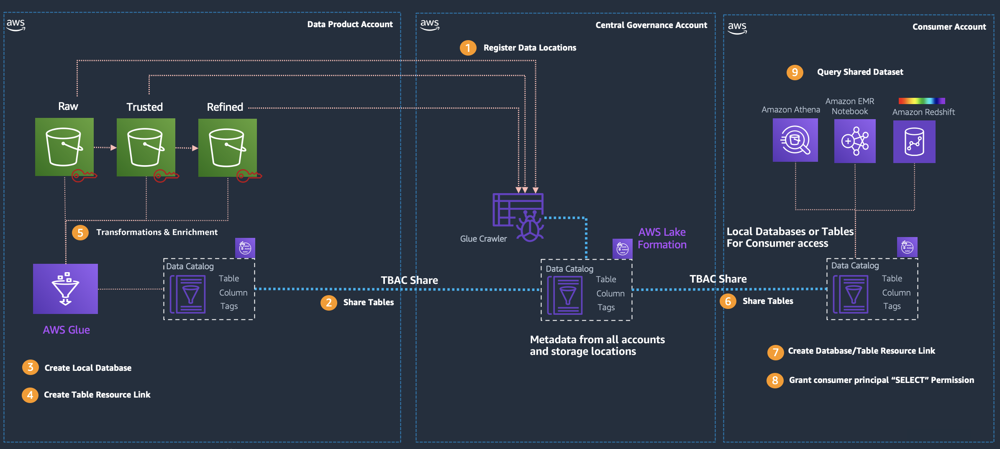
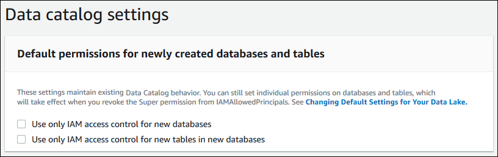
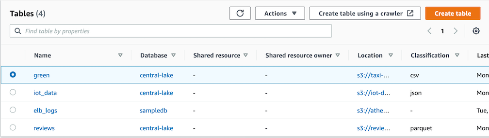
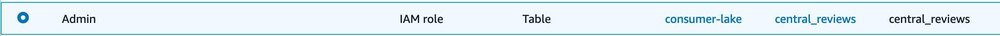

# Data Mesh with AWS Lake Formation, AWS Glue, and the CDK

This is my attempt at a data mesh strategy in AWS using the CDK to aid in repeatable deployments. This is based on looking at best practices and example diagrams and bringing them all together into a cohesive demo. What I want to accomplish is giving you the ability to isolate the data in your data lake, provide a central Glue data catalog and ultimately allow consumers to access the data in their accounts without having direct access to the source objects in S3. I started this project based on watching a presentation with the diagram below and wondered how hard it would be to implement. It shows the breakout of accounts into 3 main accounts: the data product, the data governance, and consumer accounts respectively. There are a few configuration steps required for cross account tagging to take place and make the whole thing work.



## Setup

In order to run this solution as intended you should create 3 accounts in AWS. You can use them all in an AWS Organization or by themselves. I named them like below:

* Data Product Account
* Governance Account
* Data Consumer Account

With those accounts created, lets ensure your workstation is setup to launch the resources in each account. We will be using the AWS CLI and the Cloud Development Kit.

### AWS Credential Profiles

This demo assumes you have the [AWS CLI](https://aws.amazon.com/cli/) installed and you are comfortable with using it. If you need help installing the CLI take a look at the [Getting Started](https://docs.aws.amazon.com/cli/latest/userguide/cli-chap-install.html) guide for more details.

With the CLI installed on your workstation create 3 profiles, 1 for each account, in the `~/.aws/config` file for use with the AWS CLI. Follow the example below replacing the `AWS_REGION` and `*_ACCESS_KEY` and `*_SECRET_ACCESS_KEY` with a principal with the appropriate level of access to launch the Cloudformation template resources into each account. In my testing, I used an IAM user with the `AdministratorAccess` policy applied but you can scope down approriately.

``` bash
[profile product]
region = AWS_REGION
aws_access_key_id = LAKE_ACCESS_KEY
aws_secret_access_key = LAKE_SECRET_ACCESS_KEY

[profile central]
region = AWS_REGION
aws_access_key_id = LF_ACCESS_KEY
aws_secret_access_key = LF_SECRET_ACCESS_KEY

[profile consumer]
region = AWS_REGION
aws_access_key_id = LF_ACCESS_KEY
aws_secret_access_key = LF_SECRET_ACCESS_KEY
```

### AWS CDK Toolkit

You will also be using the [AWS CDK Toolkit](https://aws.amazon.com/cdk/) to deploy the appropriate resources in each account. You can follow the [Getting Started](https://docs.aws.amazon.com/cdk/latest/guide/getting_started.html) guide to install and become familiar with how to use it.

With the CDK installed the next thing to get started is to bootstrap each account for the CDK to handle uploading assets.
Use the CDK CLI to bootstrap all 3 accounts in the region of your choice. All scripts should work in regions supporting the resources used in the templates.

Use the `cdk bootstrap` command to bootstrap the AWS environment. The following examples illustrate bootstrapping of one and two environments, respectively. (Both use the same AWS account.) As shown in the second example, the aws:// prefix is optional when specifying an environment.

``` bash
cdk bootstrap aws://123456789012/us-east-1
cdk bootstrap 123456789012/us-east-1 123456789012/us-west-1
```

For purposes of this project we will bootstrap one region for each account like below, replacing the `*_ACCOUNT_NUMBER` with the respective account id for each and `REGION` with the region of your choice.:

``` bash
cdk bootstrap aws://LAKE_ACCOUNT_NUMBER/REGION --profile product

cdk bootstrap aws://CENTRAL_ACCOUNT_NUMBER/REGION --profile central

cdk bootstrap aws://CONSUMER_ACCOUNT_NUMBER/REGION --profile consumer
```

### Almost there!!

One last one-time setup task is required before launching the CDK scripts. We need to preconfigure settings in AWS Lake Formation to take advantage of the governance capabilities to lock down the databases, tables, and columns in the central account.

#### Install Projen

[projen](https://github.com/projen/projen) synthesizes project configuration files such as package.json, tsconfig.json, .gitignore, GitHub Workflows, eslint, jest, etc from a well-typed definition written in JavaScript.

```bash
npm install projen

projen
```

This will install the projen library and when running `projen` it will create the configuration files needed by editing the .projenrc file. Once you have run this it will install the required libraries and aid in getting the appropriate cdk versioned libraries.

#### Change Data Catalog Settings

Lake Formation starts with the "Use only IAM access control" settings enabled for compatibility with existing AWS Glue Data Catalog behavior. We want to use the Lake Formation capabilities in this demo so we will be disabling these settings to enable fine-grained access control with Lake Formation permissions. [Change default AWS Lake Formation settings.](https://docs.aws.amazon.com/lake-formation/latest/dg/change-settings.html) 

***To change the default Data Catalog settings***

1. Go to the Lake Formation console at https://console.aws.amazon.com/lakeformation/ in each account.

1. Ensure that you are signed in as the IAM administrator user that you created with the `AdministratorAccess` AWS managed policy.

1. In the navigation pane, under `Data catalog`, choose `Settings`.

1. Clear both check boxes and choose `Save`.

  


5. In the navigation pane, under `Permissions`, choose `Admins and database creators`.

6. Under `Database creators`, select the `IAMAllowedPrincipals` group, and choose `Revoke`.

7. The Revoke permissions dialog box appears, showing that `IAMAllowedPrincipals` has the Create database permission.

8. Choose `Revoke` and hit `Save`.

Once the steps above are completed you are now ready to launch the CDK scripts in each account. Find the `cdk.context.json` document in the root of this project and open it in your favorite editor. If the file does not exist go ahead and create it. We need to add 5 keys for the 3 accounts, initial password for consumer account, and the region of your choice to run in like below.

***Once the EMR Studio section is complete ensure you run `aws emr create-default-roles` in the `Consumer` account before creating the resources with the CDK.***

``` json 
{
  "region": "us-east-1",
  "lakeAccountId": "123456789012",
  "centralAccountId": "210987654321",
  "consumerAccountId": "678901234567",
  "initialPassword": "Abc12345#" // password for the consumer account to use as initial password for dataAnalyst user
}
```

Default pipelines have been created in the `lib/pipelines` directory. This pipeline is an ingestion pipeline to land data into the data product account and not the data pipelines that you might create in enriching and transforming the data in the product account. You can follow along with their implementations to create your own. To start with there will be 4 pipelines deployed in the `product` account. You might be familiar with some of them, they are:

* ***yellow*** - This is a sample of the NY Taxi yellow data set available [here](https://registry.opendata.aws/nyc-tlc-trip-records-pds/).
* ***green*** - This is a sample of the NY Taxi green data set available [here](https://registry.opendata.aws/nyc-tlc-trip-records-pds/).
* ***reviews*** - This is a sample of the Amazon Reviews data set avaiable [here](https://s3.amazonaws.com/amazon-reviews-pds/readme.html).
* ***iot-data*** - This data is generated with a Lambda function and sent in real time to a Kinesis Data Stream.

### Deploy scripts to accounts!!!

With the CDK context file updated you are now ready to execute the scripts in each account. Follow the steps below:

``` bash
cdk deploy DataProductStack --profile product

cdk deploy DataCentralStack --profile central

cdk deploy DataConsumerStack --profile consumer
```

***When destroying the CDK scripts in your account any S3 bucket created in the script will be deleted along with all content in those buckets***

***When destroying the CDK scripts in your account and account that had Lake Formation tags automatically created will fail on delete in the custom resource. If it fails delete all tags and try again.***

## Lake Account

The `Product` account contains all the data sets that will be used in the demo. They have been defined in the `lib/pipelines` folder and added to the `bin/data-mesh.ts` file as an array of pipelines that will be loaded into the account. You can create data sets and data streams by adding pipelines like below. For data streams the lake will create a Kinesis Data Stream with and attached Kinesis Daa Firehose to land the data into S3. For data sets it will copy existing objects from an open data set into your own lake account locations. In the CloudFormation template each data set will be created as an individual nested stack from the main stack. Refer to the existing code for more examples.

For `data sets` these attributes are required:

* ***name*** - name of the deta set defined in the lake
* ***destinationBucketName*** - unique name of S3 bucket to create in the lake account
* ***destinationPrefix*** - where in the data set bucket you would like to land the data
* ***sourceBucketName*** - location of existing open data set bucket to pull from
* ***sourceKeys*** - the specific objects you would like to copy over into your lake
* ***dataCatalogOwner*** (optional) - Account Id of the central catalog you want to use
* ***job*** - (optional) - Glue Job parameters for taking data from the raw stream or data set and execute ETL transformations in.
* ***table*** (optional) - Glue Table definition for the raw data set or stream
  
For `data stream` these attributes are required:

* ***name*** - name of the deta set defined in the lake
* ***destinationBucketName*** - unique name of S3 bucket to create in the lake account
* ***destinationPrefix*** - where in the data set bucket you would like to land the data
* ***streamName*** - Name of the Kinesis Data Stream to send data.
* ***lambdaDataGenerator*** - The fields needed to create a Lambda function and Scheduled event to send data to the stream noted above
* ***dataCatalogOwner*** (optional) - Account Id of the central catalog you want to use
* ***job*** (optional) - Glue Job parameters for taking data from the raw stream or data set and execute ETL transformations in.
* ***table*** (optional) - Glue Table definition for the raw data set or stream

``` typescript
import * as path from 'path';
import * as cdk from '@aws-cdk/core';
import * as events from '@aws-cdk/aws-events';
import * as lambda from '@aws-cdk/aws-lambda';

import { DataPipelineType } from "../constructs/data-lake";
import { Pipeline } from "../constructs/pipeline";
import { buildEventRuleName, buildGlueJobName, buildKinesisStreamName, buildLambdaFunctionName, buildRoleName, buildS3BucketName } from "../constructs/utils";
import { GlueJobType, GlueVersion, GlueWorkerType } from '../constructs/etl/glue-job';

export function IoTDataPipeline(accountId: string, dataCatalogOwnerAccountId: string, region: string, stage: string) {
  const databaseName: string = 'product-lake'
  const streamName: string = buildKinesisStreamName({
    name: 'iot-data',
    accountId: accountId,
    region: region,
    resourceUse: 'stream',
    stage: stage
  })
  const destinationBucketName: string = buildS3BucketName({
    name: 'iot',
    accountId: accountId,
    region: region,
    resourceUse: 'datalake',
    stage: stage
  })

  return new Pipeline({
    type: DataPipelineType.STREAM,
    name: 'iot-data',
    destinationPrefix: 'raw/iot-data/',
    destinationBucketName: destinationBucketName,
    streamProperties: {
      streamName: streamName,
      lambdaDataGenerator: {
        code: lambda.Code.fromAsset(path.join(__dirname, '../lambda/iot-data-generator')),
        handler: 'index.handler',
        timeout: cdk.Duration.seconds(300),
        runtime: lambda.Runtime.PYTHON_3_7,
        functionName: buildLambdaFunctionName({
          name: 'iot-data-generator',
          accountId: accountId,
          region: region,
          resourceUse: 'datalake',
          stage: stage
        }),
        schedule: events.Schedule.expression("rate(1 minutes)"),
        ruleName: buildEventRuleName({
          name: 'iot-generator',
          accountId: accountId,
          region: region,
          resourceUse: 'datalake',
          stage: stage
        })
      }
    },
    dataCatalogOwner: {
      accountId: dataCatalogOwnerAccountId,
    },
    job: {
      jobScript: './lib/code/iot_data/streaming_convert_to_parquet.py',
      jobType: GlueJobType.GlueStreaming,
      name: buildGlueJobName({
        name: 'iot_data_streaming',
        accountId: accountId,
        region: region,
        resourceUse: 'datalake',
        stage: stage
      }),
      workerType: GlueWorkerType.G1X,
      description: 'Glue ETL Streaming job to convert JSON to Parquet',
      glueVersion: GlueVersion.v2,
      jobArgs: {        
        "--class": "GlueApp",            
        "--job-bookmark-option": "job-bookmark-disable",
        "--SOURCE_DATABASE": databaseName, 
        "--SOURCE_TABLE": "r_iot_data", 
        "--STREAM_BATCH_TIME_SECS": "100 seconds", 
        "--DESTINATION_DATABASE": databaseName,
        "--DESTINATION_TABLE": "p_iot_data",
        "--DESTINATION_BUCKET": destinationBucketName
      },
      maxCapacity: 2,
      maxConcurrentRuns: 1,
      maxRetries: 3,
      numberOfWorkers: 2,
      roleName: buildRoleName({
        name: 'glue-streaming',
        accountId: accountId,
        region: region,
        resourceUse: 'datalake',
        stage: stage
      }),
      timeout: 2880,      
    },
    table: {
      catalogId: accountId,      
      columns: [
        {
            name: "sensor_id",
            type: "int"
        },
        {
            name: "current_temperature",
            type: "double"
        },
        {
            name: "status",
            type: "string"
        },
        {
            name: "event_time",
            type: "string"
        }
      ],
      inputFormat: "org.apache.hadoop.mapred.TextInputFormat",
      outputFormat: "org.apache.hadoop.hive.ql.io.HiveIgnoreKeyTextOutputFormat",
      description: "Raw IOT Sensor data",
      parameters: {
        streamARN: `arn:aws:kinesis:${region}:${accountId}:stream/${streamName}`,
        typeOfData: "kinesis",
        classification: "json"
      },
      serdeParameters: {
        "paths": ""
      },
      serializationLibrary: "org.openx.data.jsonserde.JsonSerDe",
      tableName: "r_iot_data",
      partitionKeys: []
    }
  });
}
```

## Central Account

The central account will be the account that hosts the centralized Glue data catalog that will provide governance over the data in the data product account and allow permissions for the consumer accounts to access the data. In this account we will assign tag policies to the data catalog as well as allow the product and consumer accounts access to the data through the tagging policies defined.

### Populate the Catalog

The first thing we want to do is populate the Glue data catalog with the metadata of the data in the `Product` account. The CDK script created a Glue crawler for each data set. Go to the [AWS Glue service page](https://console.aws.amazon.com/glue/) and select the `Crawlers` link from the left hand nav. For each crawler listed, click the check box one at a time and click the `Run Crawler` button. This will populate the Glue data catalog and it should look like below.



### Resource Tagging

[Tag-based access control (TBAC)](https://docs.aws.amazon.com/lake-formation/latest/dg/TBAC-overview.html) gives you the ability to control access to resources (databases, tables, and columns) through policy tags. Two tagging ontologies were created when running the CDK script for the `DataCentralStack` through the attributes like below:

``` json
  policyTags: {
    "classification": "classified,pii,open",
    "owner": "product,central,consumer"
  }  
```

You can now associate these tags with the Glue data catalog to control access to your resources centrally. When tags are applied they cascade to resources below. For example, if you tag the `Database` with policyTag `classification=open` it will propograte to the `tables` and `columns` within the `database`. Perform the following steps below on the central account to provide access to the consumer account through TBAC.

### Grant Data Lake Administrator Tag access

In the steps below you will grant the data lake administrator both `DESCRIBE` and `ASSOCIATE` permissions to allow them to see and assign tags to resources.

* On the [AWS Lake Formation service page](https://console.aws.amazon.com/lakeformation/) click the `Administrative roles and tasks` link and ensure you have added your role as a `Data Lake Administrator`.
* Under this tab also select the `Tag Permissions` link.
* Click the `Grant` button and under `Principals` find your `IAM Role` in my case my `Admin` role but could also be `central-lake-db-creator-prod-<REGION>-<AWS ACCOUNT>` or `central-lake-admin-prod-<REGION>-<AWS ACCOUNT>`, click the `Add policy tag` in `key` select `classification` and check all the values in `Values`  and under `Permissions` select `DESCRIBE` and `ASSOCIATE` under `Tag permissions` and `Grantable permissions`. This allows you to assign tags to resources and principals.

Repeat this process for the `owner` tag.

Now that the administrator has access to describe and associate tags let's add a tag to a database.

* On the [AWS Lake Formation service page](https://console.aws.amazon.com/lakeformation/) click the `Databases` link under `Data Catalog`.
* Select the `central-lake` database and from the `Actions` drop down menu select `Edit tags`
* Click the `Assign new policy tag` and in the `Assigned keys` select `classification` and `Values` select `classified`.
* Click the `Save` button.
* Now select the radio button for the `yellow` and `reviews` tables in the `central-lake` database and click the `Action` drop down menu and select `Edit tags`.
* You will see `classification` is associated to this table with a value `classified (inherited)`. This is because the tag propogates down to the tables and columns.
* Change the `classified (inherited)` value to `open` and click `Save`.

### Principal Tagging

#### Product Account
With the catalog populated and the tags asscociated you can now add the data owner tag to the data. With AWS Lake Formation you can assign principals the data permissions they need to access the data. Follow the steps below to add the `Product` account as an owner of the resources in the data lake.

* Click the `Data Permissions` link on the left hand nav.
* Click the `Grant` button.
* On the screen find the radio button for `External accounts` in the `Principals` section and click it.
* In the `AWS account or AWS organization` textbox enter in your `Product` AWS account Id and click `Enter` to add it to the list.
* In the `Policy tags or catalog resources` section keep the `Resources matched by policy tags` radio button selected that is the new recommended approach.
* Click the `Add policy tag` button and in the `Key` select `owner` and the `Values` check only the `product` value.
* Leave `Database Permissions` and `Grantable permissions` under `Database Permissions` choose the `product-db` and select `DESCRIBE`, `ALTER`, `CREATE TABLE`. ***You cannot select `SUPER` or `DROP` on database for TBAC access cross account***
* For `Table and column permissions` for both `Table permissions` and `Grantable permissions` check the `DESCRIBE`, `ALTER`, `DROP`, `DELETE`, `INSERT`, and `SELECT` check boxes.
* Click the `Grant` button to save the permissions.

This will give the `Product` account full control of the database and table resources it is responsible for. The last task we need to complete is granting the `Product` account access to the S3 location.

* Click the `Data Locations` link on the left hand nav under `Permissions`.
* Click the `Grant` button.
* On the screen find the radio button for `External accounts` and select it.
* In the `AWS account or AWS organization` textbox enter in your `Product` AWS account Id and click `Enter` to add it to the list.
* In the `Storage locations` textbox enter in the S3 location for each data set in the `Product` account. Examples would be:
  * `taxi-green-data-<STAGE>-<REGION>-<>ACCOUNT_ID`
  * `taxi-yellow-data-<STAGE>-<REGION>-<>ACCOUNT_ID`
  * `iot-datalake--<STAGE>-<REGION>-<>ACCOUNT_ID`
  * `reviews-data-<STAGE>-<REGION>-<>ACCOUNT_ID`
* Click the `Grant` button to save the permissions.

Repeat the steps above for each data set of the `Product` account.

#### Consumer Account (Consumer)
With the catalog populated and the tags asscociated you can now add consumers to the data. With AWS Lake Formation you can assign principals the data permissions they need to access the data. Follow the steps below to add the `Consumer` account as a consumer in the data lake.

* Click the `Data Permissions` link on the left hand nav.
* Click the `Grant` button.
* On the screen find the radio button for `External accounts` in the `Principals` section and click it.
* In the `AWS account or AWS organization` textbox enter in your `Consumer` AWS account Id and click `Enter` to add it to the list.
* In the `Policy tags or catalog resources` section keep the `Resources matched by policy tags` radio button selected that is the new recommended approach.
* Click the `Add policy tag` button and in the `Key` select `classification` and the `Values` check only the `open` value.
* Leave `Database Permissions` and `Grantable permissions` under `Database Permissions` leave empty.
* For `Table and column permissions` for both `Table permissions` and `Grantable permissions` check the `SELECT` and for the column permission select all. You could filter columns here to minimize access if needed.
* Click the `Grant` button to save the permissions.

This will give the `Consumer` account read only access to the table resources in the `Central` account.

Tagging the external `Consumer` account allows AWS Lake Formation to create pointers to the `Central` Glue data catalog tables in the `Consumer` account. Let's move onto the `Consumer` account to see how we provide access there.

## Consumer Account

This `Consumer` account has no objects in S3 and a Glue data catalog with a database named `consumer-lake` with no tables. When we granted access by tags to this account in the `Central` account we gave the `Consumer` account pointers to the `Central` Glue data catlog. We will create `Resource Links` in this account from the `Central` account in order to allow users in this account to have access to the data in the `Product` account.

You will see that the all the tables but `green` from the `central-lake` database in the `Central` account are visible. This is because we allowed the `Consumer` account to access the tables tagged with `classification=open` in the `Central` account. These are the pointers back to the central Glue data catalog. Follow the steps below to create resource links and assigne permissions to access these tables.

* Find the `reviews` table in the catalog and click the radio button.
* From the `Actions` drop down menu select `Create resource link`. [What are resource links?](https://docs.aws.amazon.com/lake-formation/latest/dg/resource-links-about.html)
* In the `Resource link name` textbox fill in `central_reviews` and in the `Database` drop-down select `consumer-lake`.
* Leave the defaults for the shared information as they are the pointer back to the `Central` account and click `Create`. (***Note:*** the page will refresh and not go back to the tables page so watch for the page refresh)
* Click the `tables` link in the top line breadcrumb to go back to the list of tables.
* You should now see *`central_reviews`* in italics. This indicates you have successfully created the resource link.
* From the `Actions` drop down menu with the radio button selected for the *`central_reviews`* table select `Grant on target`.
* Leave the `IAM users and roles` radio button selected and in the drop down find your IAM Role. (For me I used the `Admin` role that I was logged into but you can create a different IAM User and grant them access.)
* In the `Permissions` section for `Table permissions` click the checkboxes for `Select`. This will give the user read access to the *`central_reviews`* table and you can leave the `Grantable Permissions` empty.
* Click `Grant`.
* Repeat the steps above for the `yellow` table.
* 
You should now have a row in the `Data Permissions` view like below:



With the Resource Links created it's now time to assign the approriate `Data Permissions` to the `datalakeAnalyst` user.

* From the Lake Formation Tables view select the radio button next to `central_yellow` and from the `Action` drop down select the `Grant` option.
* On the screen find ensure the radio button for `IAM users and roles` in the `Principals` section and click it.
* From the drop down select the `datalakeAnalyst` user.
* The next section `Policy tags or catalog resources` should be pre-populated with the `Named resource` you selected above of the `central_yellow` table and `consumer-lake` database.
* Here you are granting permissions to the resource link that will also help in populating the Athena catalog in the next section.
* In the `Resource link permissions` select the checkbox for `DESCRIBE` and leave the `Grantable Permissions` empty.
* Click the `Grant` button.

Repeat this process for the `central_reviews` table.

Now that the resource links have been created lets create tags in the consumer account and add to the approriate resources.

* On the [AWS Lake Formation service page](https://console.aws.amazon.com/lakeformation/) click the `Administrative roles and tasks` link and ensure you have added your role as a `Data Lake Administrator`.
* Under this tab also select the `Policy Tags` link and click the `Add Tag` button on the right hand side.
* In the dialog add the value `access` to the `Key` and in the `Values` add the values `analyst` and `engineer` click `Add` and then click `Add Tag`.
* Now, under this tab also select the `Tag Permissions` link.
* Click the `Grant` button and under `Principals` find your `IAM Role` in my case my `Admin` role but could also be `central-lake-db-creator-prod-<REGION>-<AWS ACCOUNT>` or `central-lake-admin-prod-<REGION>-<AWS ACCOUNT>`, click the `Add policy tag` in `key` select `access` and check all values and under `Permissions` select `DESCRIBE` and `ASSOCIATE` under `Tag permissions` and `Grantable permissions`. This allows you to assign tags to resources and principals.
* Finally, click the Database link in the navigation, and find the `consumer-lake` database and select the radio button next to it.
* From the `Actions` drop down select `Edit tags` and add the `access` tag with only the `analyst` value selected.
* This has added the tag to all resources under the `consumer-lake` database for the analyst user to access.

* From the Lake Formation Tables view select the radio button next to `central_yellow` and from the `Action` drop down select the `Grant on target` option.
* On the screen find ensure the radio button for `IAM users and roles` in the `Principals` section and click it.
* From the drop down select the `datalakeAnalyst` user.
* The next section `Policy tags or catalog resources` should be pre-populated with the `Named resource` you selected above. If you don't have `DESCRIBE` access from the `Central Account` the database will be empty on the UI but will work as expected.
* In the `Permissions` section for `Table permissions` click the checkboxes for `Select`. This will give the `datalakeAnalyst` read access to the *`central_yellow`* table and you can leave the `Grantable Permissions` empty.
* Click the `Grant` button.

Repeat this process for the `central_reviews` table.

With this complete, you should now be ready to query the data with Athena. Follow the steps below to see how that works.

* Log into the `Consumer Account` with the `datalakeAnalyst` User. (Find the sign on URL in the IAM Dashboard)
* Open the [Athena service page](https://console.aws.amazon.com/athena/).
* On the top menu select `Workgroup`.
* Find the `consumer-lake-workgroup-*` workgroup and select the radio button and click the `Switch Workgroup` button to get the workgroup with the appropriate IAM permissions.
* You might be asked to acknowledge, if so click the `Acknowledge` button.
* On the left hand side find the data source drop down and ensure `AwsDataCatalog` is selected and in the database drop down an ensure `central-lake` is selected.
* You should see 1 table named `central_reviews`. You can click the kebab menu icon that looks like 3 vertical dots and choose `Preview table`.
* In the `Results` pane you will see the data from the `Product` account displayed.
* Let's expand on what you can do with Athena. Click the `Named Queries` link at the top and click the row with the name `TextAnalyticsUDFDemo`.
* A dialog will appear and click the `Open Query` button.

This has opened a pre created list of queries that is using [Lambda UDFs](https://docs.aws.amazon.com/athena/latest/ug/querying-udf.html) with Athena to extend the functionality of the query using `Comprehend` to do text analysis on each row while returning the results. You can follow along with the blog post [here](https://aws.amazon.com/blogs/machine-learning/translate-and-analyze-text-using-sql-functions-with-amazon-athena-amazon-translate-and-amazon-comprehend/) to see how Lambda is used to extend the functionality.

* In Athena there is another `Named Query` for the `central_yellow` table showing how you can connect data in S3 with data in DynamoDB through using the [Federated Connectors](https://docs.aws.amazon.com/athena/latest/ug/connect-to-a-data-source.html) functionality.
* With the same workgroup sected as above run through the query showing how you can join to the `dynamodb-catalog` within Athena with the default `AwsDataCatalog` that references the Glue Data Catalog for the account.

This has walked you through setting up a data mesh in AWS using AWS Glue and Lake Formation. To recap, we started in the `Product` account setting up the raw data in S3 buckets and making them available to the `Central` account through S3 bucket policies. Next, we registered that data in the `Central` account's Glue Data Catalog and assigned the appropriate tags to both the resources and principals to extend permissions to the `Consumer` account. Finally, in the `Consumer` account we created the resource link pointer back to the `Central` account, assigned read only permissions on the target, and used Athena to query the data and enriched the data with `Comprehend` calls through UDFs. You should now be able to understand the setup required to create your won data mesh in AWS.

## Extended functionality

* Limit columns from the `Central` Glue data catalog tables for the `Consumer` account. You can view table metadata and edit tags on columns.

## Clean up

You can run the commands below to destroy all resources in each account. This will also remove all objects in S3 buckets. Look at the Errata section if the destroy command fails in the `Central` account. Policy tags need to be manually deleted at this time.


``` bash
cdk destroy DataProductStack --profile product

cdk destroy DataCentralStack --profile central

cdk destroy DataConsumerStack --profile consumer
```
